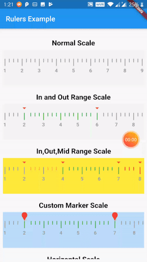

# Rulers

A Flutter Widget to show Ruler with selected values


<br/><br/>

## Getting Started
### Include
You should ensure that you add the following dependency in your Flutter project.
```yaml
dependencies:
 rulers: "^1.0.0"
```
You should then run `flutter packages get` in terminal.

### Import
In your Dart code, to use it:
```dart
import 'package:rulers/rulers.dart';
```

### Example
In your Dart code, to use it:
```
        Container(
                  margin: const EdgeInsets.only(top: 8.0),
                  child: RulerWidget(
                    scaleSize: 100,
                    scaleColor: Colors.yellow,
                    indicatorWidget: Column(
                      children: <Widget>[
                        Icon(
                          Icons.arrow_drop_down,
                          color: Colors.red,
                        ),
                      ],
                    ),
                    limit: 24,
                    interval: 3,
                    lowerLimit: 2,
                    midLimitLower: 4,
                    midLimitUpper: 7,
                    upperLimit: 8,
                    normalBarColor: Colors.grey,
                    inRangeBarColor: Colors.green,
                    behindRangeBarColor: Colors.orangeAccent,
                    outRangeBarColor: Colors.red,
                  ),
                ),
```

## Project Created & Maintained By

### Shivam Srivastava
<a href="https://play.google.com/store/apps/dev?id=7703305844118303242&hl=en">
</a> <a href="https://medium.com/@theshivamlko"></a>
<a href="https://twitter.com/theshivamlko"></a>
<a href="https://linkedin.com/in/theshivamlko"></a>
<a href="https://facebook.com/shivamlove11"></a>
<a href="https://instagram.com/theshivamlko"></a>


For help getting started with Flutter, view our online
[documentation](https://flutter.dev/docs/get-started/install).